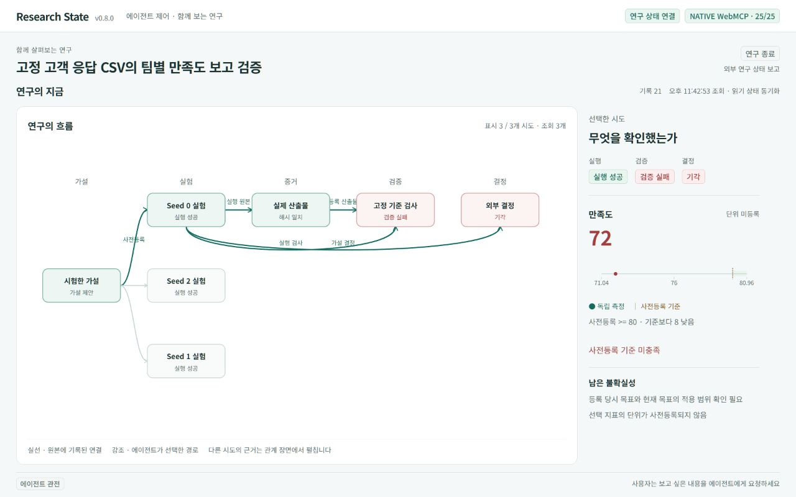
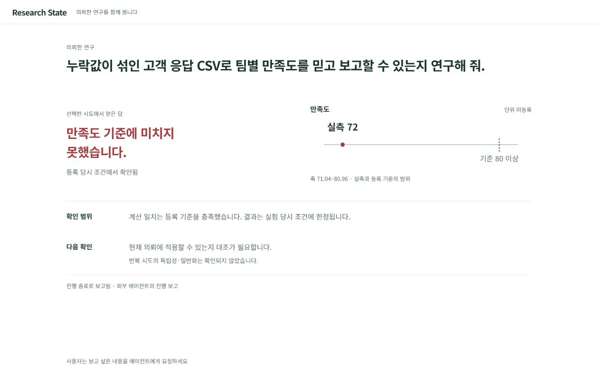
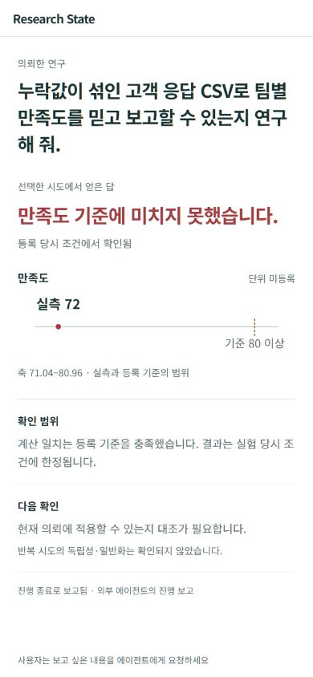

# 의뢰인 화면 검증 · 2026-10-05

기본 화면을 연구 운영 구조에서 의뢰인이 읽는 보고로 바꿨다. 의뢰 문장, 선택한 시도의 답, 실제 값·등록 기준, 확인 범위와 다음 확인이 먼저 보인다. 관계도·seed·상태 배지 묶음·도구 수·버전·기록 번호는 설명 장면에 남긴다. 사람의 버튼·입력이 필요한 흐름은 추가하지 않았다.

실제 사례는 **계산 일치 기준 충족과 만족도 기준 미달이 함께 존재**한다. 이를 분리해 보여 주며, 만족도는 현재 확인된 72와 등록 기준 80 이상을 비교한다. 단위는 미등록이므로 `%`를 추정하지 않는다. 목표 종료는 외부 진행 보고이고 결과 승인 의미를 만들지 않는다. 현재 목표와 등록 당시 목표의 적용 범위를 대조해야 한다는 제한도 유지한다.

## 실제 화면

수정 전 1280×800: 운영 관계가 앞서고 결과가 오른쪽 설명에 있다.



최종 설치본 1280×800: 의뢰 질문, 결과와 비교 그림, 확인 범위·다음 확인 두 행이다. 기본 보고 높이는 약 452px로 남은 영역 약 549px 안에 들어가며 긴 상세 열이 없다.



최종 설치본 390×844: 핵심 질문·답·수치·확인 범위·필수 한계가 한 흐름으로 들어간다. 기본 보고 높이 약 546px, 사용 가능 영역 약 584px이며 가로 넘침이 없다.



캡처는 브라우저의 JPEG 원본 바이트를 그대로 저장하고 다시 읽어 검사했다. 크기·스크롤 범위·원본 SHA-256은 [캡처 목록](validation/client-spectator-20261004/screenshots.json)에 있다. 02~11은 제작·검증 중간 캡처이며, 미확인 진행 상태의 잘못된 외부 보고 접미사는 최종판에서 제거했다. 최종 확인된 개발 기록 화면은 12, 실제 의뢰 화면은 15·16를 사용한다.

## 확인한 동작

| 검사 | 실제 확인 |
|---|---|
| 등록 기준 미달 | 실제 의뢰에서 만족도 72 < 80, 계산 일치 1은 별도 충족으로 표시 |
| 현재 검증된 결과 | 32개 개발 등록 중 선택한 가중 평균 5 == 5, 현재 기준 충족; 전체 진행은 미확인 유지 |
| 빈 저장소·미실행 | 결과 없음·실행 결과 미확인, 수치 차트 없음; 작업 중이라고 추정하지 않음 |
| 누락·변조 | 개발용 단일 산출물만 일시 시험; 현재 확인 불가, 과거 통과·채택 승격 없음, metric.value=null·차트 없음 |
| 원본 복원 | SHA-256 원본 일치로 복원한 후 현재 확인된 결과로 다시 읽힘; 연구 DB 변경 없음 |
| 에이전트 설명 | overview의 focus/explanation은 보고를 한 설명 장면으로 교체; 설명은 미검증으로 표시 |
| 장면 전환 | 네이티브 WebMCP 25개 발견, overview→analysis/graph→evidence→overview 성공; 인간 조작 요소 0개 |
| 설명 스크롤 | 실제 active 목표의 배경 갱신으로 DOM이 교체됐지만 scrollTop 606 유지 |
| 모션 감소 | prefers-reduced-motion=reduce에서 실행 중 애니메이션 0개; 검증 후 설정 복원 |
| 영속 규칙 보존 | DB 13개·증거 36개·실행 표식 2개·핵심 Python 모듈 12개 전후 일치 |

[실제 WebMCP 호출](validation/client-spectator-20261004/webmcp-calls.json), [설명 스크롤](validation/client-spectator-20261004/explanation-scroll.json), [설치·HTTP·불변 검사](validation/client-spectator-20261004/runtime-after.json)에 확인 범위를 남겼다. 누락·변조 시험은 `product-fixtures-20261004`의 보존된 개발 파일 하나에 한정했고 바로 원본으로 복원했다. 완료된 실제 의뢰의 증거를 수정하거나 실험을 다시 실행하지 않았다.

새 순수 `buildClientView`는 원래 `buildViewModel`의 검증 사실과 참조를 읽는다. 각 표시 항목의 refs와 DOM `data-source-references`, WebMCP `clientBrief`를 통해 원본으로 추적한다. 단위·수치·기준·상태·과학적 판단을 새로 만들지 않는다.

## 설치와 재현

버전은 0.8.0이며 최신 UI wheel은 `dist/client-spectator-20261004/research_state_cli-0.8.0-py3-none-any.whl`이다. SHA-256은 `e78c5f44b104833910c970b380c4d76ad1e3ede0f5fb342d0e190284eaa68986`. 프로젝트 `.validation-venv`·`.mcp-venv`에 설치했고 4개 웹 자산과 12개 핵심 모듈의 소스·wheel·두 설치본이 일치한다. HTTP 제공 자산도 소스와 같다. [설치 명세](validation/client-spectator-20261004/source-install-manifest.json)를 참고한다. 이전 wheel·기획·검증·캡처는 당시 기록으로 보존한다.

```powershell
node --test tests/test_view_model.mjs tests/test_observatory_projection.mjs tests/test_client_view.mjs
.\.mcp-venv\Scripts\python.exe -m unittest discover -s tests -v
.\.validation-venv\Scripts\python.exe validation\client_spectator_check.py after --require-assets
```

표현 검사 **88/88**, 기존 기능 검사 **65/65** 통과. 읽기 전후 불변·설치 자산 일치도 통과했다. 기존 검증 함수를 얇은 래퍼로 재사용해 이전 증거 폴더를 덮어쓰지 않았다. [설계·원본 대응표](CLIENT-VIEW-DESIGN.ko.md), [웹 호출 안내](WEB.ko.md), [후속 핸드오프](HANDOFF.ko.md)에 현행 사용법을 기록했다.

## 한계

실제 의뢰인 사용자 테스트를 수행한 결과는 아니다. 읽는 순서·반복 정보·배치를 개선하고 실제 데이터를 확인했지만 이해도·연구 성능 향상을 입증하지 않는다. 기본 답은 선택한 등록 조건의 결과이며 의뢰 전체에 대한 자동 과학적 결론이 아니다. 서로 다른 의뢰의 의미를 자동 해석하지 않으며 등록 이름·원래 의뢰 문장이 불충분하면 상세 설명이 필요하다. 누락과 변조의 개별 원인은 원문·관계 설명에서 확인한다. 다른 브라우저·호스트·보조기술은 별도 검증이 필요하다. 최종 연구 효과 비교와 기억 ON/OFF 평가는 이번 화면 보정에 포함하지 않는다.
